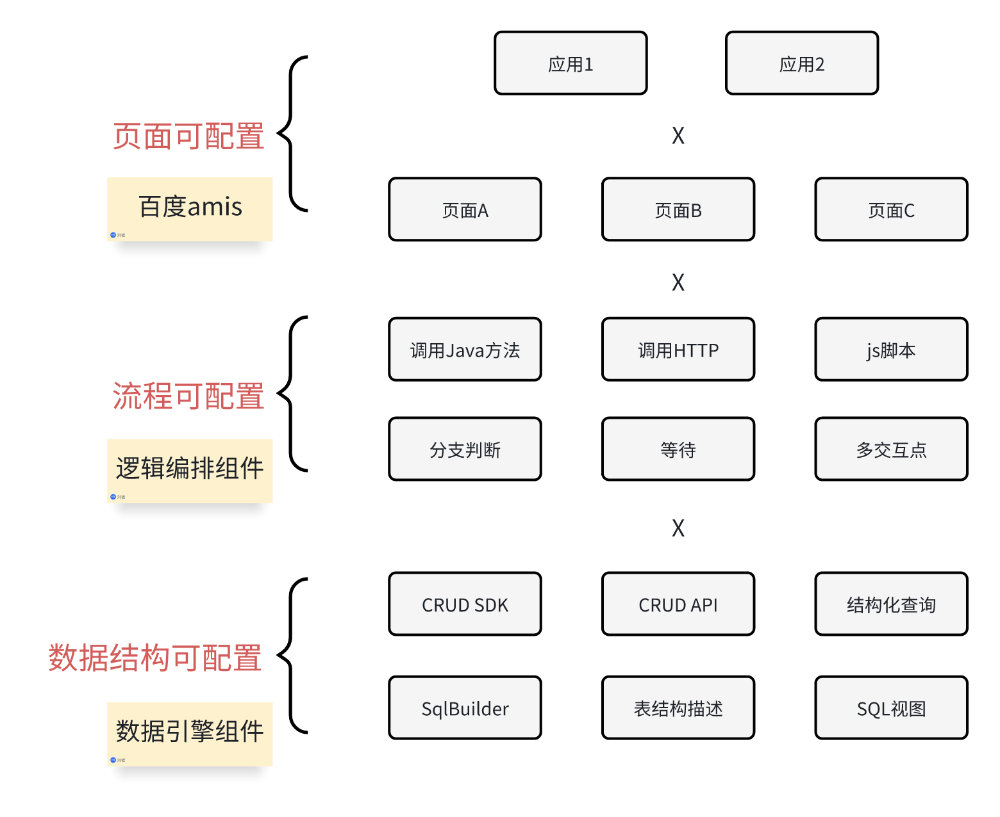

# 轻应用
## 简介
用于产品MVP、轻量定制开发的快速响应，渐进式迭代。

## 使用demo项目快速开始
- 创建空的数据库，在数据库中执行脚本[tableAndData.sql](tableAndData.sql)
- 修改application.yaml中的数据库链接、用户名和密码
- 启动项目，访问[http://localhost:19000/lapp](http://localhost:19000/lapp)
## 相关资料
- [轻应用快速开始](https://o4wsztdxg4.feishu.cn/wiki/VJMZwERpli9LR2kBOgscS6mjnAb?from=from_copylink)
- [逻辑编排知识库](https://o4wsztdxg4.feishu.cn/wiki/AEzIwqBxHiHUMvkz8OVc8qCZnHh)

## 联系我
- 微信
  